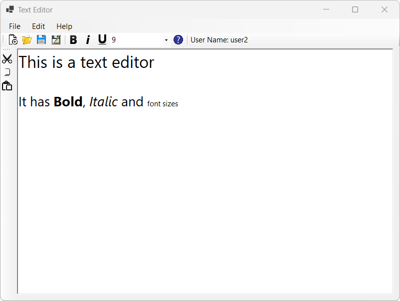

# .Net Assignment 1
 
A C# program with the .NET framework created for the Application Development with .NET subject at UTS. 
Designed to be a simple bank management system allowing the user to create, edit and delete accounts with data stored in text files and a bank statement emailing function.

